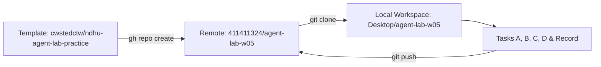

# NDHU Campus Agent Lab · 實作總結報告 (Summary Report)

> **專案代號**：`agent-lab-w05`  
> **組別代碼**：`W05-01`  
> **使用工具**：Antigravity Agent  
> **GitHub 儲存庫**：[https://github.com/411411324/agent-lab-w05](https://github.com/411411324/agent-lab-w05)  
> **完成狀態**：100% 完成（Task A、Task B v1/v2、Task C、Task D、實作紀錄）

---

## 一、 實作背景與環境建置

本實驗為東華大學 **Campus Agent Lab** 教學實作，旨在練習與 AI 助理協同合作時的四項核心判斷力：
1. **看懂計畫**：在 Agent 動手前審核操作範圍與權限邊界。
2. **檢查成果**：利用雜湊檢驗、邊界條件測試驗收產出品質。
3. **辨認確認動作**：不以字眼臆測定稿，保留未決策草案與重複檔。
4. **退回不合理做法**：及時糾正越權存取、破壞性刪檔與數據偽造。

### 環境配置紀錄
- **GitHub CLI 檢驗**：確認本機具備 `gh version 2.101.0`，並以 `411411324` 身份認證成功。
- **儲存庫建立**：透過 `gh repo create 411411324/agent-lab-w05 --template cwstedctw/ndhu-agent-lab-practice --public` 建立遠端儲存庫。
- **本地 Clone 與身份綁定**：
  - 本地路徑：`C:\Users\sfyeh\OneDrive\Desktop\agent-lab-w05`
  - Git 設定：`user.name: 411411324`、`user.email: 411411324@users.noreply.github.com`。



---

## 二、 任務實作與驗收成果摘要

### Task A｜社團檔案整理 (`practice/01-club-files`)
- **兩階段原則**：嚴格落實「第一階段唯讀分析與計畫提報 $\rightarrow$ 使用者確認回覆『執行』 $\rightarrow$ 第二階段建立 output 歸檔」。
- **檔案處理**：
  - `input` 12 個文字檔案**完全無修改、無刪除**。
  - 依功能歸類至 4 個子目錄：`proposals/`、`publicity/`、`meetings_and_admin/`、`equipment/`。
- **品質驗證**：
  - **SHA-256 雜湊比對**：12 個輸出檔案與輸入原檔雜湊 100% 吻合（例如 `announcement.txt` 為 `C19164B1...`）。
  - **完全重複處理**：`announcement` 與 `equipment` 重複檔均各自保留副本。
  - **版本差異辨認**：`proposal_final.txt`（室外30分）與 `proposal_final2.txt`（室內20分）內容相異且皆未定案，嚴格禁止依檔名刪除任何一案。
- **產出檔案**：
  - [`output/manifest.json`](file:///C:/Users/sfyeh/OneDrive/Desktop/agent-lab-w05/practice/01-club-files/output/manifest.json)：12 筆物件之來源、目的與理由清單。
  - [`output/report.md`](file:///C:/Users/sfyeh/OneDrive/Desktop/agent-lab-w05/practice/01-club-files/output/report.md)：分類說明、疑似重複分析與待確認問題。

---

### Task B｜課間活動挑選器 (`practice/02-campus-picker`)
- **架構特點**：單頁純前端離線網頁（`index.html`），內嵌 12 筆活動資料，無外部 CDN、無網路請求、雙擊即可開啟。
- **功能規範**：
  - 地點（室內/室外/不限）、時間（15/30/60分鐘）、強度（低/中/不限）三維嚴格交集篩選。
  - 成功抽選即時記錄最近 5 次歷史紀錄（最新在頂部，支援清除）。
  - 無符合條件時顯示提示且不放寬條件、不計入歷史紀錄。
  - 中英雙語即時無縫切換（UI 控制項、狀態文字、活動名稱同步切換）。
- **版本演進 (v1 $\rightarrow$ v2)**：
  - **v1（第一版）**：實現核心篩選、隨機抽取、歷史隊列與雙語介面。
  - **v2（一次修改）**：新增「即時符合活動數量標籤」（條件變更時即時計算候選數量，0 筆時紅底警示）與「鍵盤快捷鍵支援」（`Enter`/`Space` 抽取、`Esc` 重設篩選）。
- **測試矩陣驗收**：
  | 測試案例 | 預期結果 | 實際結果 |
  |---|---|---|
  | 室內／15分／低強度 | 僅可能選中 A01 ~ A04 | 抽中 A02（畫小卡），完全符合 |
  | 室外／15分／中強度 | 0 筆符合，顯示無符合活動 | 顯示紅底無符合項目，條件未被放寬 |
  | 室外／30分／中強度 | 僅 1 筆符合（A09） | 每次均為 A09（合適位置快走） |
  | 不限／60分／不限（抽6次） | 隊列維持最新 5 筆 | 歷史清單僅保留最近 5 次，最新在上 |
  | 快捷鍵與重設 | Enter 觸發抽籤、Esc 重設 | 鍵盤操作順暢，重設時保留歷史紀錄 |

---

### Task C｜社團器材記錄資料清理 (`practice/03-equipment`)
- **原始資料**：`equipment.json` 共 10 列模擬記錄，原始檔不動。
- **清理規則與成效**：
  1. **全空列過濾**：第 6 列全空物件 `{}` 正確移除（原始 10 列 $\rightarrow$ 9 列有效資料）。
  2. **文字修剪**：所有文字欄位前後空格皆修剪乾淨（`EQ01`, `EQ07` 等）。
  3. **借用狀態統一**：`可借`/`可出借`/`available` $\rightarrow$ `available`；`借出`/`borrowed` $\rightarrow$ `borrowed`；第 9 列「待盤點」標記為 `unknown`。
  4. **異常數量保護**：第 7 列缺數量（`qty: ""`）與第 8 列負數（`qty: -1`）均**原樣保留**，不自行補 0、不取絕對值、不猜測。
  5. **衝突記錄保留**：`EQ01` 兩筆相同紀錄均保留；`EQ02` 出現數量衝突（列2為2、列5為3），兩者均保留並於問題報告中指明。
- **產出檔案**：
  - [`output/normalized.json`](file:///C:/Users/sfyeh/OneDrive/Desktop/agent-lab-w05/practice/03-equipment/output/normalized.json)：9 筆標準化資料。
  - [`output/issues.md`](file:///C:/Users/sfyeh/OneDrive/Desktop/agent-lab-w05/practice/03-equipment/output/issues.md)：列數統計、異常數值清單與衝突追溯表。

---

### Task D｜審核模擬計畫並退回 (`practice/04-review`)
- **審核對象**：`bad-plan.txt`（「整理 Downloads 全部、刪除重複檔、final2 當最新版、缺資料補合理值、自動公開成果」）。
- **審核結果**：**全數退回（REJECTED）**。
- **指陳缺失與安全替代方案**：
  1. **越權存取 Downloads** $\rightarrow$ 嚴格限制於指派專案子資料夾。
  2. **擅自刪除重複檔** $\rightarrow$ 原檔嚴格不動，採複製副本並以清單回報。
  3. **憑 final2 認定最新版** $\rightarrow$ 檔名非定案保證，保留全部版本待人工決策。
  4. **自行腦補數值** $\rightarrow$ 偽造數據不可取，應標記缺漏並回報。
  5. **未授權自動發佈** $\rightarrow$ 成果留置本機 output，待人工驗收核定。
- **產出檔案**：[`practice/04-review/my-rejection.md`](file:///C:/Users/sfyeh/OneDrive/Desktop/agent-lab-w05/practice/04-review/my-rejection.md)

---

## 三、 Git 提交歷史與追溯矩陣

儲存庫依作業規範完成每一次任務之獨立 Commit 與遠端同步，追溯鏈如下：

```
* 42aee8c (HEAD -> main, origin/main) record: learning record and screenshots
* 3687054 C: normalize equipment data
* 9d65a0f D: rejection
* c56c46d B v2: add match count badge and keyboard shortcuts
* f35d7c6 B v1: activity picker
* 0f44250 A: organize club files
* 36f6869 Initial commit from template
```

| Commit Hash | Commit Message | 包含檔案與內容 |
|---|---|---|
| `0f44250` | `A: organize club files` | `practice/01-club-files/output/`（12 檔副本、manifest.json、report.md） |
| `f35d7c6` | `B v1: activity picker` | `practice/02-campus-picker/output/index.html`（活動挑選器單頁 v1） |
| `c56c46d` | `B v2: add match count badge and keyboard shortcuts` | `practice/02-campus-picker/output/index.html`（v2 修改：即時數量與快捷鍵） |
| `9d65a0f` | `D: rejection` | `practice/04-review/my-rejection.md`（模擬計畫退回決策與說明） |
| `3687054` | `C: normalize equipment data` | `practice/03-equipment/output/`（normalized.json、issues.md） |
| `42aee8c` | `record: learning record and screenshots` | `submission-template.md` 與 `evidence/learning-record.md` |

---

## 四、 實作學習反思與未驗證事項 (Still Unverified)

在 AI 輔助軟體開發與資料處理的過程中，Agent 可以極高效率地執行分析、代碼生成與格式標準化，但仍有以下事項**不能草率宣稱已全部完成**，必須由人類決策者把關：

1. **實體業務定案**：Task A 中室內與室外兩份企畫草案及預算審查，屬於社團實體治理決策，Agent 僅能整理保留，無法替代幹部投票。
2. **隨機性理論檢驗**：Task B 之挑選器已通過所有條件分支驗收，但數次手動測試無法等同於嚴謹的統計檢驗；此外模擬活動並非東華校方實際開放之服務。
3. **實體器材盤點**：Task C 指出之數量衝突（`EQ02` 借出數到底是 2 還是 3）與負數數量（`EQ05` 膠帶 -1），為原始紀錄缺陷，必須靠庫房實地盤點清查。
